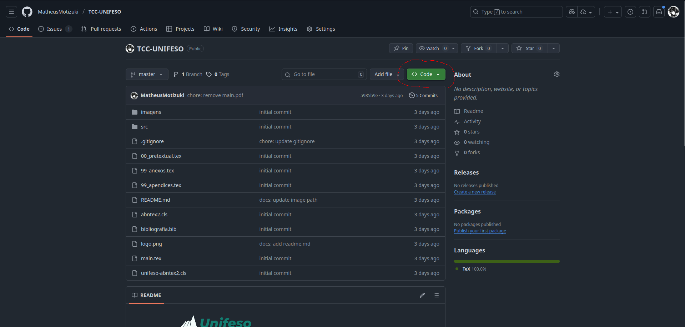
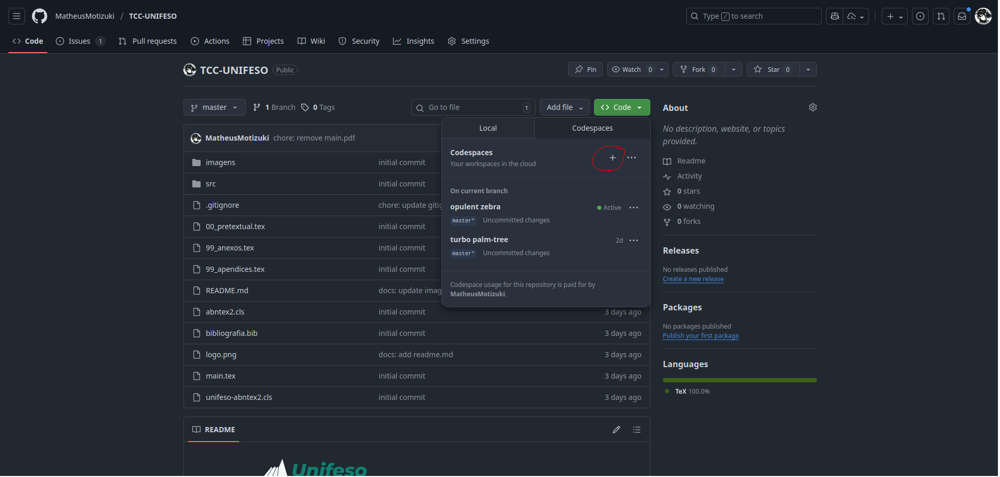

### Como executar o projeto

1. **Crie um Codespace:**
    - 
    - 

2. **Abra o terminal e instale o compilador LaTeX:**
    ```bash
    sudo apt-get install texlive-full -y
    ```

3. **Compile o arquivo principal:**
    ```bash
    pdflatex main.tex
    ```

    > Se as referências não aparecerem corretamente, execute a sequência abaixo para corrigir:
    ```bash
    pdflatex main.tex
    bibtex main
    pdflatex main.tex
    pdflatex main.tex
    ```

4. **Para visualizar o PDF, instale a extensão LaTeX Workshop (por James Yu) no VS Code.**
